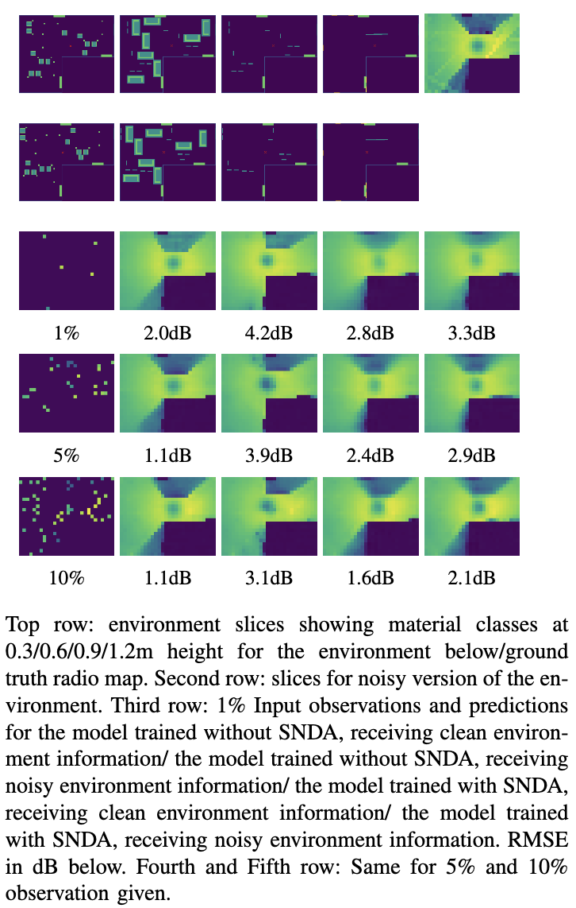
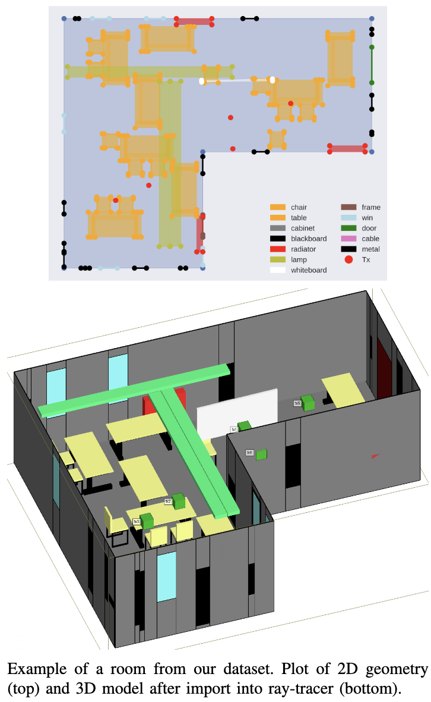

This repository contains the code used for the paper "Radio Map Prediction from Noisy Environment Information and Sparse Observations" ([https://arxiv.org/abs/2602.11950](https://arxiv.org/abs/2602.11950), submitted to IEEE). 

We investigate the prediction of radio maps in indoor environments using CNN and sparse observations (samples) from the ground truth. Since in reality the available information of the environment is often incomplete, inaccurate or partially outdated, we investigate whether CNNs can be trained with simulated noise as data augmentation (SNDA) in order to make them robust to similar noise at test time as well. The noise/perturbations we consider are shifted object and Tx locations and perturbed material properties. Furthermore, we compare different levels of detail to encode different materials of objects and the floorplan: binary (only presence of some object/free space), classes (e.g. wood, metal, glass sharing similar electromagnetic properties) and detailed electromagnetic material properties. 
Our results show that, on our dataset, the models trained with binary encoding achieve highest accuracy. Furthermore, training with SNDA increases robustness to noise at test time.

# Overview of the Code
- *lib* contains model architectures, dataset and training/testing logic
- the scripts in the main folder are used to run training/testing with different parameters for trained models and baselines
- *script_training_testing.py* is used to train the models and runs a basic test on the synthetic data with the same (potentially random) observation percentage as during training
- *script_combined_tests.py* runs more detailed tests for different fixed observation percentages per run and for different levels of noise severity and different types of noise/perturbations
- *script_baselines_obs_perc.py* is used to test baselines on for varying observation percentage on the synthetic test set
- the dataset from (to be added) is expected to be placed under *./dataset*
- *env* contains .yml files describing the mamba env we used
- *nb_measurements.ipynb* contains the code used for test on real world measurements

# Links
- the code for the generation of indoor environments is available at https://github.com/fabja19/WI_indoor_projects
- the dataset will be uploaded in the next days to Zenodo, we will place the link here